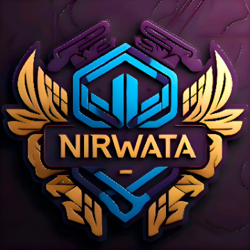

# # ✨ Welcome to @Nirwata Channel 🌟

## 🚀 About

Nirwata is a personal project started on March 27, 2025.

## ⚡ Service Status (27/03/2025)

| Bot Name | Status |
|----------|--------|
| NirwataBot | Offline ❌ |
| NirwataChatBot | Offline ❌ |
| NirwaraMenfessBot | Offline ❌ |
| NirwataMatchBot | Offline ❌ |
| NirwataGroupBot | Offline ❌ |
| NirwataAdsBot | Offline ❌ |
| NirwataCloneBot | Offline ❌ |
| NirwataSupportBot | Offline ❌ |

⚠️ All bots are currently under development.

## 🤖 Available Bots

1. **[@NirwataBot](https://t.me/NirwataBot)** ⚡
   - Main registration bot with automatic verification
   - Profile management system
   - Reward system for active members

2. **[@NirwataChatBot](https://t.me/NirwataChatBot)** 💭
   - Anonymous chat platform
   - Interest matching system
   - Automatic content filtering
   - Layered security system

3. **[@NirwaraMenfessBot](https://t.me/NirwaraMenfessBot)** 💌
   - Anonymous confession service
   - AI moderation system
   - Custom categories
   - Anonymous reply features

4. **[@NirwataMatchBot](https://t.me/NirwataMatchBot)** 💘
   - Friend/partner finding system
   - Advanced matching algorithms
   - Location filtering
   - User verification system

5. **[@NirwataGroupBot](https://t.me/NirwataGroupBot)** 👥
   - Group management system
   - Anti-spam protection
   - Custom welcome messages
   - Comprehensive group statistics

6. **[@NirwataAdsBot](https://t.me/NirwataAdsBot)** 📢
   - Advertising platform
   - Specific targeting options
   - Real-time analytics
   - Automated payment system

7. **[@NirwataCloneBot](https://t.me/NirwataCloneBot)** 🔄
   - Bot cloning service
   - Full customization options
   - Automatic backup system
   - Technical support included

8. **[@NirwataSupportBot](https://t.me/NirwataSupportBot)** 🛟
   - 24/7 help assistant
   - AI support system
   - Ticket management
   - Support team integration

## 📢 Official Channels

1. **[@NirwataUpdate](https://t.me/NirwataUpdate)** 📣
   - Latest feature updates
   - Maintenance information
   - Important announcements

2. **[@NirwataNews](https://t.me/NirwataNews)** 📰
   - Project news and updates
   - Event announcements
   - Partnership information
   - Project milestones

3. **[@NirwataLogs](https://t.me/NirwataLogs)** 📝
   - System change documentation
   - Security updates
   - Real-time bug fixes

4. **[@NirwataMedia](https://t.me/NirwataMedia)** 🎬
   - Tutorial videos
   - Feature showcases
   - Community highlights

5. **[@NirwataMenfess](https://t.me/NirwataMenfess)** 💌
   - Anonymous confessions
   - Curated content
   - Trending topics

## 👥 Community Groups

1. **[@NirwataCommunity](https://t.me/NirwataCommunity)** 🏠
   - Main discussion group
   - Experience sharing
   - Member interaction

2. **[@NirwataChat](https://t.me/NirwataChat)** 💬
   - Casual chat room
   - Various topics
   - Community activities

3. **[@NirwataGames](https://t.me/NirwataGames)** 🎮
   - Gaming community
   - Regular tournaments
   - Ranking system
   - Exciting prizes

4. **[@NirwataSupport](https://t.me/NirwataSupport)** ℹ️
   - Technical support
   - 24/7 active admins
   - Real-time solutions

## 🔗 Official Links

- Website: [nirwata.github.io](https://nirwata.github.io)
- Documentation: [nirwata.github.io/docs](https://nirwata.github.io/docs)

## 📞 Contact

- Email: nirwatabot@gmail.com
- Support: [@NirwataSupport](https://t.me/NirwataSupport)

## ⚖️ License

Copyright © 2025 Nirwata. All rights reserved.

---

Made with ❤️ by Nirwata

